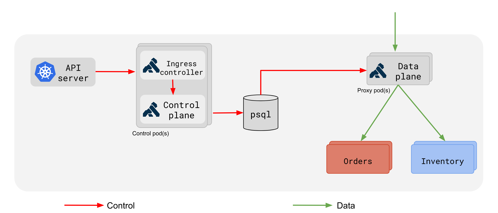

# Kong Ingress Controller

This repository contains an Ingress controller for Kubernetes that works by deploying [Kong][0] as a reverse proxy and load balancer.

## Prerequisites

Tested with Kubernetes clusters running version 1.8 and later.

## Get started

Please check the [deployment documentation][1]

## How it works?

Using a standard [Kubernetes deployment][10], the Ingress controller runs multiple containers in a single pod. This allows us to define in a unit containing an [initContainer][11] to run Kong migrations, one container for the Kong admin API in control-plane mode and one container for the ingress controller itself. With this approach we simplify the deploy of the required components without user intervention.
Once the deployment passes the readiness and liveness probes it means the Kong migrations ran and ingress controller can communicate with the Kong admin API.

In a different deployment we run Kong in data-plane mode. This means the Kong instances only expose the proxy ports.
By using this approach we can deploy and scale the data-plane with the requirements of your applications, i.e. using a daemonset, a deployment with affinity rules, etc.

The next diagram shows how the components interact:



## Custom annotations

Please check the [annotations][7] document.

## Annotation ingress.class

If you have multiple Ingress controllers in a single cluster, you can pick one by specifying the `ingress.class` annotation, eg creating an Ingress with an annotation like

```yaml
metadata:
  name: foo
  annotations:
    kubernetes.io/ingress.class: "gce"
```

will target the GCE controller, forcing the ingress controller to ignore it, while an annotation like

```yaml
metadata:
  name: foo
  annotations:
    kubernetes.io/ingress.class: "nginx"
```

will target the Kong Ingress controller, forcing the GCE controller to ignore it.

__Note__: Deploying multiple ingress controller and not specifying the annotation will cause both controllers fighting to satisfy the Ingress.

## Custom Resource Definitions

Please check the [custom types][8] document.

### Multiple ingress controllers

If you're running multiple ingress controllers, or running on a cloud provider that handles ingress, you need to specify the annotation `kubernetes.io/ingress.class: "nginx"` in all ingresses you would like this controller to claim. This mechanism also provides users the ability to run _multiple_ Kong ingress controllers (e.g. one which serves public traffic, one which serves "internal" traffic).
When using this functionality the option `--ingress-class` should set a value unique for the cluster. Here is a partial example:

```yaml
spec:
  template:
     spec:
       containers:
         - name: kong-ingress-internal-controller
           args:
             - /kong-ingress-controller
             - '--election-id=ingress-controller-leader-internal'
             - '--ingress-class=kong-internal'
```

Not specifying the annotation will lead to multiple ingress controllers claiming the same ingress.
Setting a value which does not match the class of any existing ingress controllers will cause all ingress controllers ignoring the ingress.

### Why the default `kubernetes.io/ingress.class` is "nginx"?

This is to provide out of the box compatibility with tools like [kube-lego][2]

### Why endpoints and not services

The Kong ingress controller does not use [Services][3] to route traffic to the pods. Instead it uses the Endpoints API to bypass [kube-proxy][4] to allow Kong features like session affinity and custom load balancing algorithms.
It also removes overhead, such as conntrack entries for iptables DNAT.

### Relation with ingress-nginx

This repository uses code from [ingress-nginx][5] as the base.
Code like annotations are not present because some features are present as [plugins][6].

### Roadmap

Please check the [roadmap][9] document.

[0]: http://getkong.org
[1]: deploy/README.md
[2]: https://github.com/jetstack/kube-lego
[3]: http://kubernetes.io/docs/user-guide/services
[4]: http://kubernetes.io/docs/admin/kube-proxy
[5]: https://github.com/kubernetes/ingress-nginx
[6]: https://konghq.com/plugins/
[7]: docs/annotations.md
[8]: docs/custom-types.md
[9]: docs/roadmap.md
[10]: https://kubernetes.io/docs/concepts/workloads/controllers/deployment/
[11]: https://kubernetes.io/docs/concepts/workloads/pods/init-containers/
