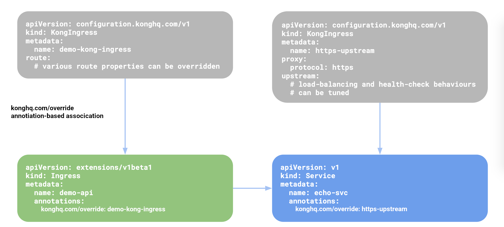
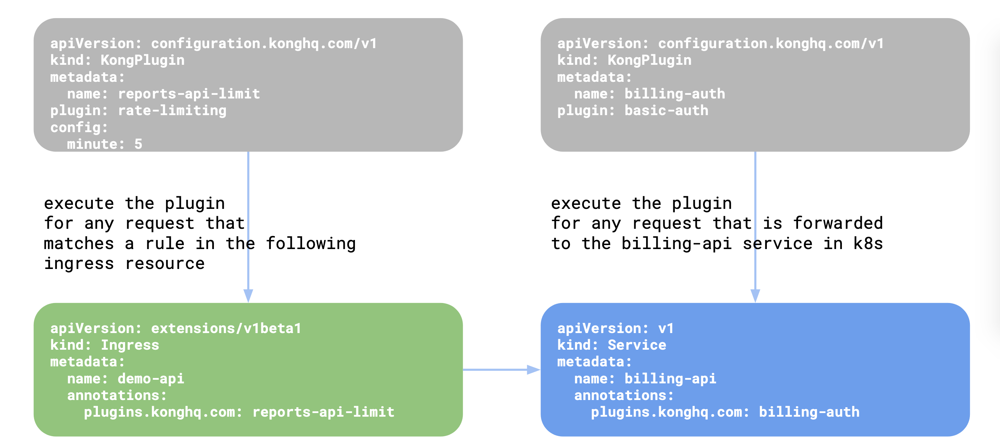

# Custom Resources

[Custom Resources][k8s-crd] in Kubernetes allow controllers
to extend Kubernetes-style
declarative APIs that are specific to certain applications.

A few custom resources are bundled with Kong Ingress Controller to configure
settings that are specific to Kong and provide fine-grained control over
the proxying behavior.

Kong Ingress Controller uses the `configuration.konghq.com` API group
for storing configuration specific to Kong.

The following CRDs allow users to declaratively configure all aspects of Kong:

- [**KongIngress**](#kongingress)
- [**KongPlugin**](#kongplugin)
- [**KongClusterPlugin**](#kongclusterplugin)
- [**KongConsumer**](#kongconsumer)
- [**TCPIngress**](#tcpingress)
- [**KongCredential (Deprecated)**](#kongcredential-deprecated)

## KongIngress

The Ingress resource in Kubernetes is a fairly narrow and ambiguous API, and
doesn't offer resources to describe the specifics of proxying.
To overcome this limitation, `KongIngress` Custom Resource is used as an
"extension" to the existing Ingress API to provide fine-grained control
over proxy behavior.
In other words, `KongIngress` works in conjunction with
the existing Ingress resource and extends it.
It is not meant as a replacement for the `Ingress` resource in Kubernetes.
Using `KongIngress`, all properties of [Upstream][kong-upstream],
[Service][kong-service] and [Route][kong-route]
entities in Kong related to an Ingress resource can be modified.

Once a `KongIngress` resource is created, you can use the `configuration.konghq.com`
annotation to associate the `KongIngress` resource with an `Ingress` or a `Service`
resource:

- When the annotation is added to the `Ingress` resource, the routing
  configurations are updated, meaning all routes associated with the annotated
  `Ingress` are updated to use the values defined in the `KongIngress`'s route
  section.
- When the annotation is added to a `Service` resource in Kubernetes,
  the corresponding `Service` and `Upstream` in Kong are updated to use the
  `proxy` and `upstream` blocks as defined in the associated
  `KongIngress` resource.

The below diagram shows how the resources are linked
with one another:

## KongPlugin

Kong is designed around an extensible [plugin][kong-plugin]
architecture and comes with a
wide variety of plugins already bundled inside it.
These plugins can be used to modify the request/response or impose restrictions
on the traffic.

Once this resource is created, the resource needs to be associated with an
`Ingress`, `Service`, or `KongConsumer` resource in Kubernetes.
For more details, please read the reference documentation on `KongPlugin`.

The below diagram shows how you can link `KongPlugin` resource to an
`Ingress`, `Service`, or `KongConsumer`:

|  |  |
:-:|:-:
|

## KongClusterPlugin

_This resource requires the [`kubernetes.io/ingress.class` annotation](../README.md#resource-classes)._

KongClusterPlugin resource is exactly same as KongPlugin, except that it is a
Kubernetes cluster-level resources instead of being a namespaced resource.
This can help when the configuration of the plugin needs to be centralized
and the permissions to add/update plugin configuration rests with a different
persona than application owners.

This resource can be associated with `Ingress`, `Service` or `KongConsumer`
and can be used in the exact same way as KongPlugin.

A namespaced KongPlugin resource takes priority over a
KongClusterPlugin with the same name.

## KongConsumer

_This resource requires the `kubernetes.io/ingress.class` annotation. Its value
must match the value of the controller's `--ingress-class` argument, which is
"kong" by default._

This custom resource configures `Consumers` in Kong.
Every `KongConsumer` resource in Kubernetes directly translates to a
[Consumer][kong-consumer] object in Kong.

## TCPIngress

_This resource requires the `kubernetes.io/ingress.class` annotation. Its value
must match the value of the controller's `--ingress-class` argument, which is
"kong" by default._

This Custom Resource is used for exposing non-HTTP
and non-GRPC services running inside Kubernetes to
the outside world via Kong. This proves to be useful when
you want to use a single cloud LoadBalancer for all kinds
of traffic into your Kubernetes cluster.

It is very similar to the Ingress resource that ships with Kubernetes.

## KongCredential (Deprecated)

Once a `KongConsumer` resource is created,
credentials associated with the `Consumer` can be provisioned inside Kong
using KongCredential custom resource.

This Custom Resource has been deprecated and will be removed in a future
release.
Instead, please use secret-based credentials.

[k8s-crd]: https://kubernetes.io/docs/tasks/access-kubernetes-api/extend-api-custom-resource-definitions/
[kong-consumer]: https://getkong.org/docs/latest/admin-api/#consumer-object
[kong-plugin]: https://getkong.org/docs/latest/admin-api/#plugin-object
[kong-route]: https://getkong.org/docs/latest/admin-api/#route-object
[kong-service]: https://getkong.org/docs/latest/admin-api/#service-object
[kong-upstream]: https://getkong.org/docs/latest/admin-api/#upstream-objects
