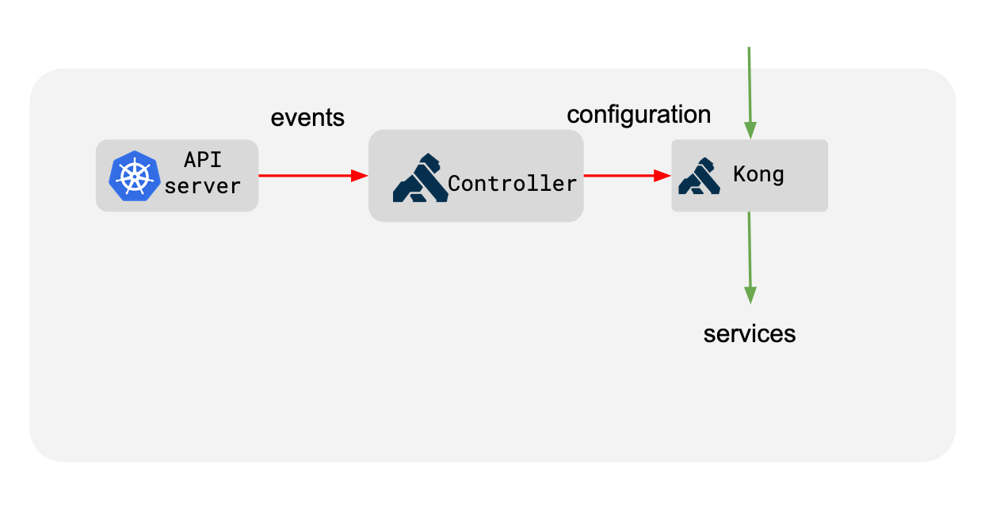

# Kong Ingress Controller Design

## Overview

Kong Ingress Controller configures Kong
using Ingress resources created inside a Kubernetes cluster.

Kong Ingress Controller is made up of two components:

- Kong, the core proxy that handles all the traffic
- Controller, a process that syncs the configuration from Kubernetes to Kong

Kong Ingress Controller performs more than just proxying the traffic coming
into a Kubernetes cluster. It is possible to configure plugins,
load balancing, health checking and leverage all that Kong offers in a
standalone installation.

The following figure shows how it works:

The Controller listens for changes happening inside the Kubernetes
cluster and updates Kong in response to those changes to correctly
proxy all the traffic.

Kong is updated dynamically to respond to changes around scaling,
configuration changes, failures that are happening inside a Kubernetes
cluster.

## Translation

Kubernetes resources are mapped to Kong resources to correctly
proxy all the traffic.

The following figure describes the mapping between Kubernetes concepts
to Kong's configuration:

Let's go through how Kubernetes resources are being mapped to Kong's
configuration:

- An [Ingress](https://kubernetes.io/docs/concepts/services-networking/ingress/)
  resource in Kubernetes defines a set of rules for proxying
  traffic. These rules corresponds to the concept of Route in Kong.
- A [Service](https://kubernetes.io/docs/concepts/services-networking/service/)
  inside Kubernetes is a way to abstract an application that is
  running on a set of pods.
  This maps to two objects in Kong: Service and Upstream.
  The service object in Kong holds the information on the protocol
  to use to talk to the upstream service and various other protocol
  specific settings. The Upstream object defines load balancing
  and healthchecking behavior.
- Pods associated with a Service in Kubernetes map as a Target belonging
  to the Upstream (the upstream corresponding to the Kubernetes
  Service) in Kong. Kong load balances across the Pods of your service.
  This means that all requests flowing through Kong are not directed via
  kube-proxy but directly to the pod.

For more information on how Kong works with Routes, Services, and Upstreams,
please see the [Proxy](https://docs.konghq.com/latest/proxy/)
and [Load balancing](https://docs.konghq.com/latest/loadbalancing/) references.
