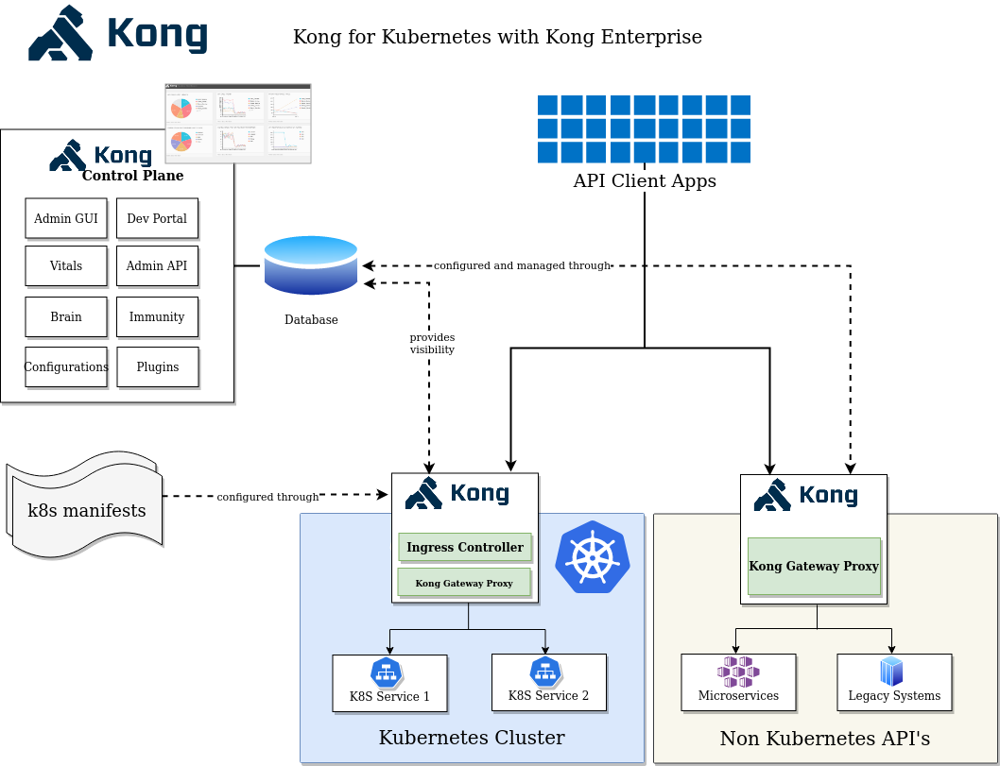

# Kong for Kubernetes with Kong Enterprise

Kong for Kubernetes is Kubernetes Ingress Controller built on top
of Open-Source Kong Gateway.

If you are an Enterprise customer, you have an option of running the
[Enterprise version](https://docs.konghq.com/enterprise/1.3-x/kong-for-kubernetes/)
of the Ingress Controller, which includes
all the Enterprise plugins but does not include Kong Manager or any
other Enterprise features. This makes it possible to
run the Ingress layer without a database, providing a very low
operational and maintance footprint.

However, in some cases, those enterprise features are necessary,
and for such use-cases we support another deployment - Kong for
Kubernetes with Kong Enterprise.

As seen in the diagram below, this deployment consists of
Kong for Kubernetes deployed in Kubernetes, and is hooked up with
a database. If there are services running outside Kubernetes,
a regular Kong Gateway proxy can be deployed there and connected to the same database. This provides a single pane of visibility of
all services that are running in your infrastructure.

In this deployment model, the database for Kong can be hosted anywhere.
It can be a managed DBaaS service like Amazon RDS, Google Cloud
SQL or a Postgres instance managed in-house or even an instance
deployed on Kubernetes.
If you are following this model, it is recommended that for
production scenarios, you do not deploy Postgres on Kubernetes,
due to the fact that running state-ful applications on Kubernetes
is challenging to get right.

[This guide](../deployment/kong-enterprise.md)
walks through the setup of the above architecture.