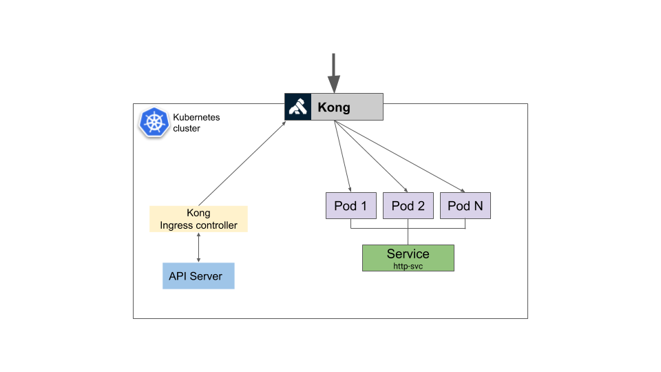

# Design

Using a standard [Kubernetes deployment][10], the Ingress controller runs multiple containers in a single pod. This allows us to define in a unit containing an [initContainer][11] to run Kong migrations, one container for the Kong admin API in control-plane mode and one container for the ingress controller itself. With this approach we simplify the deploy of the required components without user intervention.
Once the deployment passes the readiness and liveness probes it means the Kong migrations ran and ingress controller can communicate with the Kong admin API.

In a different deployment we run Kong in data-plane mode. This means the Kong instances only expose the proxy ports.
By using this approach we can deploy and scale the data-plane with the requirements of your applications, i.e. using a daemonset, a deployment with affinity rules, etc.

Following shows a high-level diagram shows how various Kong components are deployed in a kubernetes cluster:

[k8s-deployment]: https://kubernetes.io/docs/concepts/workloads/controllers/deployment/
[k8s-initcontainer]: https://kubernetes.io/docs/concepts/workloads/pods/init-containers/