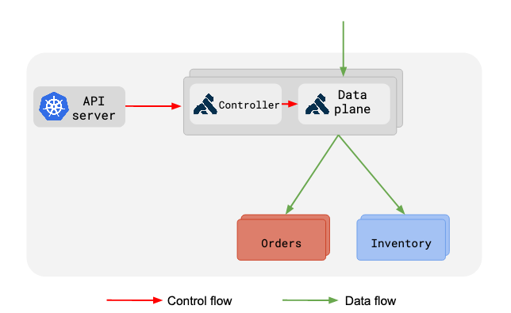
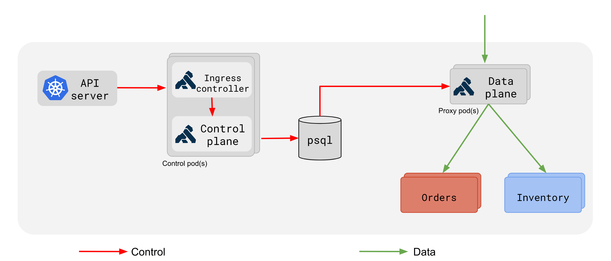
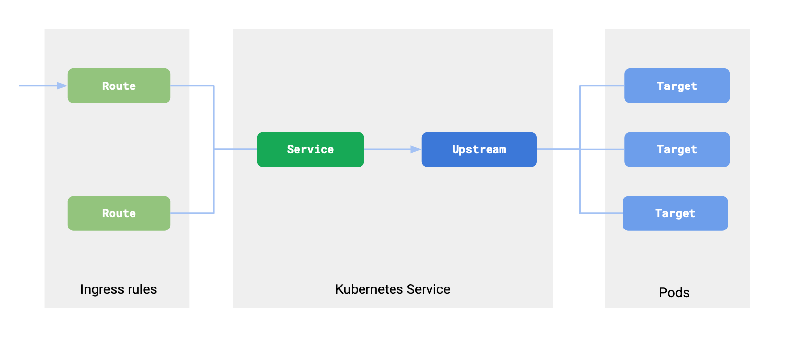

# Kong Ingress Controller Design

## Overview

Kong Ingress Controller is a dynamic and
highly available Ingress Controller which configures Kong
using Ingress resources created in your Kubernetes cluster.  
In addition, it can configure plugins, load balancing, health checking
on your services running inside Kubernetes.

## Deployment

Kong's Ingress Controller is a Golang application
that talks to Kubernetes API server
and [translates](#translation) Kubernetes resources into Kong.

Kong's Ingress Controller can run in two modes depending on how
Kong is being deployed.

### Kong backed without a database

In DB-less deployments, Kong's Ingress controller runs as a sidecar to Kong
container and configures Kong dynamically as per changes it receives from
the k8s API server.

Scaling up Kong and making it highly available can be done by horizontally
scalling out Kong pods.

### Kong backed with a database

In a deployment where Kong is backed by a DB, Kong's Ingress Controller
is deployed separately from Kong's data plane nodes.

Kong's Ingress Controller is deployed together with Kong's Control plane pods.

In the above deployment figure, a Kong Control-Plane pod is
deployed alongside the Ingress Controller pod.

Kong's state is stored in Postgres (can be Cassandra) which should be deployed
as a StatefulSet and all Kong nodes in your Kubernetes cluster should be
able to connect to the database.

Please check out [Deployment Guides](deployment/) for more
details on how to deploy Kong with Ingress Controller.

### High Availability

Multiple instances of Kong Ingress Controller pod can be deployed.
The Ingress Controller uses a leader election protocol and elects a leader.
At any point, only one leader Controller pod will be configuring Kong and
other follower pods will be ready to take over as soon as the leader fails.

### Scaling Kong

If Kong is deployed in Control-plane and Data-plane mode, then
Kong proxy can be scaled independently.
By using this approach we can deploy and scale the data-plane
with the requirements of your applications,
i.e. using a DaemonSet, a deployment with affinity rules,
HorizontalPodAutoscaler etc.

## Translation

Kong Ingress Controller is a translator from
Kubernetes resources to resources in Kong.

Following figure shows how resources in Kubernetes are translated
into Kong's data model:

The figure shows the translation of Ingress resource, services and
pods in Kubernetes to corresponding resources in Kong.

## Custom Resources

There are a few [Custom Resource Definitions(CRDs)][k8s-crd] available
that can be used to configure plugins, health checks, load balancing,
consumers, their credentials in Kong using the Ingress Controller.

Please read through our [Custom Resources][custom-resources]
documentation for details.

[k8s-deployment]: https://kubernetes.io/docs/concepts/workloads/controllers/deployment/
[k8s-initcontainer]: https://kubernetes.io/docs/concepts/workloads/pods/init-containers/
[k8s-crd]: https://kubernetes.io/docs/concepts/extend-kubernetes/api-extension/custom-resources/
[custom-resources]: custom-resources.md