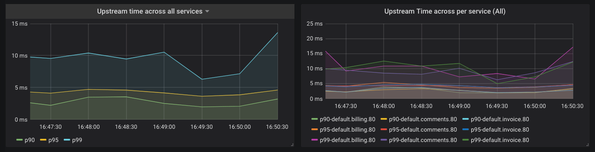
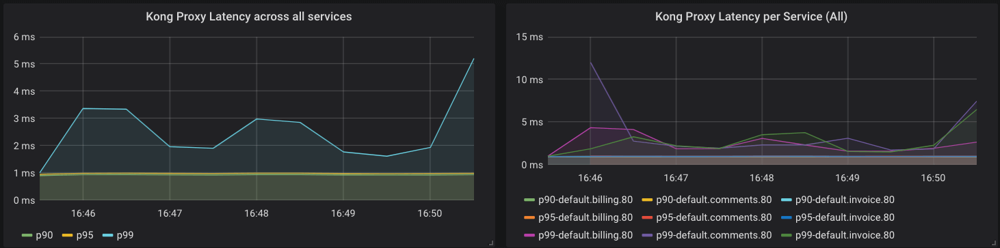
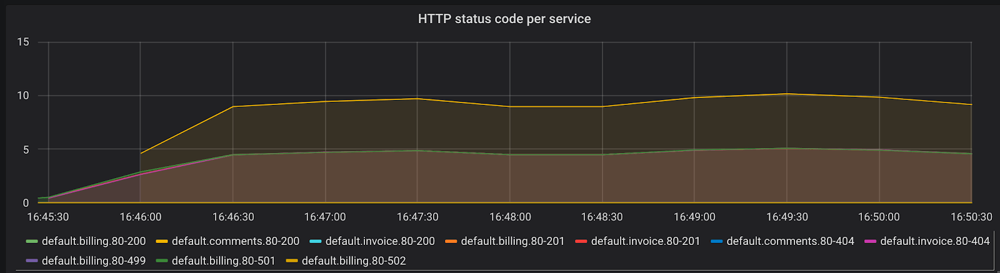
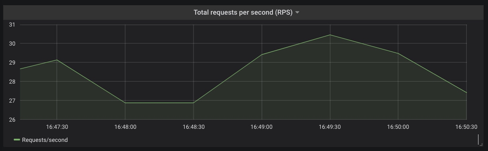
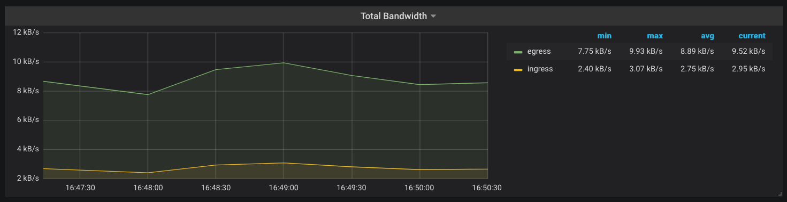

# Integrate Kong Ingress Controller with Prometheus/Grafana

Kong Ingress Controller can give you visibility not only into how Kong is
performing but also gives visibilty into
how the services in your Kubernetes cluster are responding to the
inbound traffic.

This how-to guide walks through the steps of how to configure Kong and
Prometheus to collect metrics from Kong Ingress Controller.

> Note: This guide was originally posted on Kong Inc's blog:
[https://konghq.com/blog/observability-kubernetes-kong/](https://konghq.com/blog/observability-kubernetes-kong/)

## Prerequisites

You’ll need a few things before we can start:

- **Kubernetes cluster**: You can use Minikube or a GKE cluster for the
  purpose of this tutorial. We are running a GKE Kubernetes cluster v1.12.x.
- **Helm**: We will be using [Helm](https://helm.sh/)
  to install all of our components.
  Tiller should be installed on your k8s cluster and
  Helm CLI should be available on your workstation.
  You can follow Helm’s quickstart guide to set up helm.

Once you have Kubernetes and Helm set up, please proceed.

Caution: Settings here are tweaked to keep this guide simple.
These settings are not meant for production usage.

## Install Prometheus and Grafana

If you already have Prometheus and Grafana installed on your Kubernetes cluster,
you can skip these steps.

### Prometheus

First, we will install Prometheus with a
scrape interval of 10 seconds to have fine-grained data points for all metrics.
We’ll install both Prometheus and Grafana in a dedicated `monitoring` namespace.

To install Prometheus, execute the following:

```bash
$ helm install --name prometheus stable/prometheus --namespace monitoring --values https://bit.ly/2RgzDtg --version 11.0.3
```

### Grafana

Grafana is installed with the following values for its Helm chart
(see comments for explanation):

```yaml
persistence:
  enabled: true  # enable persistence using Persistent Volumes
datasources:
 datasources.yaml:
   apiVersion: 1
   Datasources:  # configure Grafana to read metrics from Prometheus
   - name: Prometheus
     type: prometheus
     url: http://prometheus-server # Since Prometheus is deployed in
     access: proxy    # same namespace, this resolves
                      # to the Prometheus Server we installed previous
     isDefault: true  # The default data source is Prometheus

dashboardProviders:
  dashboardproviders.yaml:
    apiVersion: 1
    providers:
    - name: 'default' # Configure a dashboard provider file to
      orgId: 1        # put Kong dashboard into.
      folder: ''
      type: file
      disableDeletion: false
      editable: true
      options:
        path: /var/lib/grafana/dashboards/default
dashboards:
  default:
    kong-dash:
      gnetId: 7424  # Install the following Grafana dashboard in the
      revision: 5   # instance: https://grafana.com/dashboards/7424
      datasource: Prometheus
```

To install Grafana, execute the following:

```bash
$ helm install stable/grafana --name grafana --namespace monitoring --values http://bit.ly/2FuFVfV --version 5.0.8
```

## Install Kong

We will use Kong's Helm chart to install Kong
but you can also use plain manifests for this purpose.

```bash
$ helm repo add kong https://charts.konghq.com
$ helm repo update

# helm 2
$ helm install kong/kong --namespace kong --name mykong --version 1.3.1 --values https://bit.ly/2UAv0ZE

# helm 3
$ helm install kong/kong --namespace kong --name mykong --version 1.3.1 --values https://bit.ly/2UAv0ZE --set ingressController.installCRDs=false
```

### Enable Prometheus plugin in Kong

We will enable the Promtheus plugin in Kong at the global level, meaning
each request that flows into the Kubernetes cluster gets tracked in Prometheus:

```bash
$ echo 'apiVersion: configuration.konghq.com/v1
kind: KongClusterPlugin
metadata:
  name: prometheus
  labels:
    global: "true"
plugin: prometheus
' | kubectl apply -f -
kongclusterplugin.configuration.konghq.com/prometheus created
```

## Set Up Port Forwards

Now, we will gain access to the components we just deployed.
In a production environment, you would have a Kubernetes Service with
an external IP or load balancer, which would allow you to access
Prometheus, Grafana, and Kong.
For demo purposes, we will set up port-forwarding using kubectl to get access.
It is not advisable to do this in production.

Open a new terminal and execute the following commands:

```bash
POD_NAME=$(kubectl get pods --namespace monitoring -l "app=prometheus,component=server" -o jsonpath="{.items[0].metadata.name}")
kubectl --namespace monitoring  port-forward $POD_NAME 9090 &

# You can access Prometheus in your browser at localhost:9090

POD_NAME=$(kubectl get pods --namespace monitoring -l "app.kubernetes.io/instance=grafana" -o jsonpath="{.items[0].metadata.name}")
kubectl --namespace monitoring port-forward $POD_NAME 3000 &

# You can access Grafana in your browser at localhost:3000

POD_NAME=$(kubectl get pods --namespace kong -o jsonpath="{.items[0].metadata.name}")
kubectl --namespace kong port-forward $POD_NAME 8000 &

# Kong proxy port is now your localhost 8000 port
# We are using plain-text HTTP proxy for this purpose of
# demo.
# You can also use the LoadBalancer IP address and not set up this
# port-forwarding if you are running in a cloud environment.
```

## Access Grafana Dashboard

To access Grafana, you need to get the password for the admin user.

Execute the following to read the password and take note of it:

```bash
kubectl get secret --namespace monitoring grafana -o jsonpath="{.data.admin-password}" | base64 --decode ; echo
```

Now, browse to [http://localhost:3000](http://localhost:3000) and
fill in username as “admin” and password as what you just noted above.
You should be logged in to Grafana and Kong’s Grafana Dashboard
should already be installed for you.

## Setup Services

We have all the components for monitoring installed,
we will now spin up some services for demo purposes and setup Ingress
routing for them.

### Install Services

We will set up three services: billing, invoice, and comments.
Execute the following to spin these services up:

```bash
kubectl apply -f https://gist.githubusercontent.com/hbagdi/2d8ef66fe22cb99e1514f410f992268d/raw/a03d789b70c46ccd0b99d9f1ed838dc21419fc33/multiple-services.yaml
```

### Install Ingress for the Services

Next, once the services are up and running, we will create Ingress
routing rules in Kubernetes.
This will configure Kong to proxy traffic destined for these services correctly.

Execute the following:

```bash
echo '
apiVersion: extensions/v1beta1
kind: Ingress
metadata:
  name: sample-ingresses
  annotations:
    konghq.com/strip-path: "true"
    kubernetes.io/ingress.class: kong
spec:
  rules:
  - http:
     paths:
     - path: /billing
       backend:
         serviceName: billing
         servicePort: 80
     - path: /comments
       backend:
         serviceName: comments
         servicePort: 80
     - path: /invoice
       backend:
         serviceName: invoice
         servicePort: 80
' | kubectl apply -f -
```

## Let’s Create Some Traffic

We’re done configuring our services and proxies.
Time to see if our setup works.
Execute the following in a new terminal:

```bash
while true;
do
  curl http://localhost:8000/billing/status/200
  curl http://localhost:8000/billing/status/501
  curl http://localhost:8000/invoice/status/201
  curl http://localhost:8000/invoice/status/404
  curl http://localhost:8000/comments/status/200
  curl http://localhost:8000/comments/status/200
  sleep 0.01
done
```

Since we have already enabled Prometheus plugin in Kong to
collect metrics for requests proxied via Kong,
we should see metrics coming through in the Grafana dashboard.

You should be able to see metrics related to the traffic flowing
through our services.
Try tweaking the above script to send different traffic patterns
and see how the metrics change.
The upstream services are httpbin instances, meaning you can use
a variety of endpoints to shape your traffic.

## Metrics collected

### Request Latencies of Various Services



Kong collects latency data of how long your services take to respond to
requests. One can use this data to alert the on-call engineer if the latency
goes beyond a certain threshold. For example, let’s say you have an SLA
that your APIs will respond with latency of less than 20 millisecond
for 95% of the requests.
You could configure Prometheus to alert based on the following query:

```text
histogram_quantile(0.95, sum(rate(kong_latency_bucket{type="request"}[1m])) by (le,service)) > 20
```

The query calculates the 95th percentile of the the total request
latency (or duration) for all of your services and alerts you if it is more
than 20 milliseconds.
The “type” label in this query is “request”, which tracks the latency
added by Kong and the service.
You can switch this to “upstream” to track latency added by the service only.
Prometheus is highly flexible and well documented, so we won’t go into
details of setting up alerts here, but you’ll be able to find them
in the Prometheus documentation.

### Kong Proxy Latency



Kong also collects metrics about its performance.
The following query is similar to the previous one but gives
us insight into latency added by Kong:

```text
histogram_quantile(0.90, sum(rate(kong_latency_bucket{type="kong"}[1m])) by (le,service)) > 2
```

### Error Rates



Another important metric to track is the rate of errors and requests
your services are serving.
The time series `kong_http_status` collects HTTP status code metrics
for each service.

This metric can help you track the rate of errors for each of your service:

```text
sum(rate(kong_http_status{code=~"5[0-9]{2}"}[1m])) by (service)
```

You can also calculate the percentage of requests in any duration
that are errors. Try to come up with a query to derive that result.

Please note that all HTTP status codes are indexed, meaning you could use
the data to learn about your typical traffic pattern and identify problems.
For example, a sudden rise in 404 response codes could be indicative
of client codes requesting an endpoint that was removed in a recent deploy.

### Request Rate and Bandwidth



One can derive the total request rate for each of your services or
across your Kubernetes cluster using the `kong_http_status` time series.



Another metric that Kong keeps track of is the amount of
network bandwidth (`kong_bandwidth`) being consumed.
This gives you an estimate of how request/response sizes
correlate with other behaviors in your infrastructure.

You now have metrics for the services running inside your Kubernetes cluster
and have much more visibility into your applications, without making
any modifications in your services.
You can use Alertmanager or Grafana to now configure alerts based on
the metrics observed and your SLOs.
